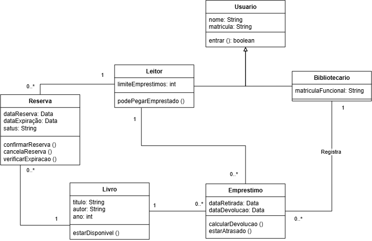

# Atividade 18 — Diagrama de Classes do BiblioTech
Nome: Gustavo Maciel da Silva
Turma: 2º ano — Técnico em Informática Integrado

## Diagrama

## Por que estes números (associação Bibliotecario — Emprestimo)
- Perto de Emprestimo eu coloquei 0..* porque o bibliotecario pode realizar mais de um emprestimo no turno
- Perto de Bibliotecario eu coloquei 1 porque um emprestimo só pode ser realizado por um bibliotecario

## Rastreabilidade (nível B)
- A operação confirmarReserva() da classe reserva atende ao caso de uso 1.4

## Autoavaliação
- Conceito que pretendo: B
- Onde isso se prova no diagrama (classe / linha / número): classe
